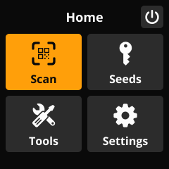

# SeedSigner UX Guidelines

### Contents

[UX Guidelines](#ux-guidelines)
- [Screen Types](#screen-types)
- [Message Types](#message-types)
- [Content](#content)
- [Information Architecture](#information-architecture)

[Appendix](#appendix)

---

# UX Guidelines

## Screen Types

- All screen types included below. Use these layouts to create new screens.

### Menu - Grid
MainMenuScreen

- Navigation screen that presents 4 options in a grid view.
- Usage: Home screen.

### Menu - List
ButtonListScreen

- Navigation screen that presents a list of 3 or more options to users with no descriptive body content.
- List items aligned to top of screen with no body content.
- Usage: Menu screens and screens with several (or dynamic) list items.

### Menu - Bottom List
ButtonListScreen, is_bottom_list=True

- Navigation screen that presents a list of 3 or less options to users with descriptive body content.
- List items aligned to bottom of screen with body content aligned to top of screen.
- Usage: Options screens.

### Input

- Contains input controls for collecting information from users.

Examples:
- Seed Input
- Passphrase Input
- Derivation Input
- BIP-85 Index
- Dice Input
- Coin Input
- I/O Test

### Review

- Summary of information before the user finalizes an action.
- 1-2 buttons to confirm completion of the task or go back / begin a new task.
- Usage: After an Input screen or at the end of a task flow before a dialog screen.

### Dialog

- Prompts the user to make a decision regarding a specific task, or to provide critical information such as confirmation of a task being completed.
- 1-2 buttons with optional messaging icon to represent message type.

Usage:
- Urgent: Show immediately, within the current context of a task  
- Not urgent: Show at the end of a task/sub-task

### Messaging

- Communication from the system that does not require interaction from the user.
- Presented as an overlay (snackbar), not its own distinct screen type.

---

## Message Types

Messages fall into 6 categories, detailed below. Each message type can be displayed via a dialog screen or snackbar overlay.

### Default

Usage:
- Low-attention messages
- Instructional messages
- Standard system prompts/feedback
- Confirm selection
- Review screens

Examples:
- Power off / Restart
- Verify backup?
- Confirm SeedQR?
- Multisig verification?

Styling:
- Color: None
- Icon: None

### Info

Usage:
- Low-attention messages
- Informational messages that do not require immediate user attention
- Inform the user of best practices
- Provide additional context
- Functionality not implemented

Examples:
- Not yet implemented
- Donate

Styling:
- Color: INFO_COLOR (#409CFF)
- Icon: SeedSignerIconConstants.INFO

### Success

Usage:
- Medium-attention messages
- Confirmation that a task or action is successful

Examples:
- Settings imported
- Backup verified
- Descriptor loaded
- Sign successful

Styling:
- Color: SUCCESS_COLOR (#30D158)
- Icon: SeedSignerIconConstants.SUCCESS

### Warning

Usage:
- Medium-attention messages
- Non-critical warning that an error may occur
- No threat of loss of funds
- Privacy warnings

Examples:
- Xpub privacy leak warning
- Unsupported script type

Styling:
- Color: WARNING_COLOR (#FFD60A)
- Icon: SeedSignerIconConstants.WARNING

### Dire Warning

Usage:
- High-attention messages
- Critical warning that an error may occur
- Threat of loss of funds
- Review screens (deletion)

Examples:
- Seed airgap warning
- SeedQR airgap warning
- Discard seed or passphrase

Styling:
- Color: DIRE_WARNING_COLOR (#FF5700)
- Icon: SeedSignerIconConstants.WARNING

### Error

Usage:
- High-attention messages
- Critical system errors where the user cannot continue
- Incorrect settings or inputs from the user
- System down, function unavailable

Examples:
- System errors
- Verification errors

Styling:
- Color: ERROR_COLOR (#FF1B0A)
- Icon: SeedSignerIconConstants.ERROR

---

## Content

### Content Guidelines

Headings:  
- As concise as possible, yet descriptive enough to be self-explanatory at a glance  
- 2 words, 13 character max (absolute max of 17 chars)  
  
Body:  
- Provide additional context for message  
- 3 lines, 72 character max  
  
Button labels:  
- 1-2 words, 21 character max  
- Sentence case  
- Include specific actions (e.g. “Discard seed” instead of “Discard”)

### Best Practices

- Be clear and concise
	- Users should immediately understand what is happening and why
	- Use as few characters as possible while maintaining clarity
	- Optimize language for translation/localization

- Use simple, non-technical language whenever possible
	- UI text should be easily understood by anyone

- Advise and guide
	- Communicate the consequences of an action
	- Give clear feedback to an action by the system
	- When applicable, provide guidance on how to resolve an issue

- Provide context
	- Display messaging in context to the user’s current task or action

- Inform and educate
	- Help users grow their technical expertise in context of the UI

---

## Information Architecture

### Clear and concise labeling

_Categories and labels should be clear and meaningful to users._
  
**Navigational labels should:**
- Make sense to all users, not just to advanced Bitcoin users
- Be concise -- maximum of 2 words if possible
- Only lead with an action verb when it's necessary for clarity
- Use "&"" instead of "and" for readability and space efficiency
- Meet users' expectations of what they'll find at a destination

### Intuitive groupings

_Like items should be clustered for enhanced discoverability._
  
**Navigational groupings should:**
- Meet user expectations (mental model)
- Consist of like items
- Adhere to cognitive load best practices
- Not have too many (or too few) items in a category

### Expected hierarchy

_The order of items should make sense and meet user expectations._
  
**Menu item hierarchy should:**
- Derive from user expectations
- Prioritize frequently-used and urgent tasks
- Leverage a common hierarchy of left-to-right or top-to-bottom based on frequency, urgency, and promoting awareness
- Utilize last position in a list (e.g. users expect Help/Contact near the bottom)

### Cognitive load control

_Decrease clutter that may confuse or distract users._
  
**To reduce cognitive load:**
- Limit the number of menus, categories, and items
- Avoid using a general category as a catch-all for orphan items
- Avoid visual clutter that may confuse or distract users

### Complementary contextual navigation

_When used, should align with the larger navigation ecosystem._
  
**Contextual navigation should:**
- Meet users' mental model for finding information and performing tasks
- Be easily visible and actionable
- Enhance but not duplicate the global navigation
- Create awareness of additional services/features

---

# Appendix

## Articles

### Messaging
- [A Comprehensive Guide to Notification Design](https://www.toptal.com/designers/ux/notification-design)
- [The Critical Role of Error Messaging in UX Design](https://bootcamp.uxdesign.cc/the-critical-role-of-error-messaging-in-ux-design-5056ca31eb22)
- [Writing clear error messages: UX guidelines and examples](https://blog.logrocket.com/ux-design/writing-clear-error-messages-ux-guidelines-examples/)
- [Best 10 Examples And Guidelines For Error Messages](https://uxwritinghub.com/error-message-examples/)